# AI Scalping Trading Agent — System Report

> **Purpose:** Paper-trading scalping agent for US stocks. Rule-based signals drive execution; LLMs can only **veto** or **rank** — they never initiate trades.  
> **Mode:** Alpaca paper account (`https://paper-api.alpaca.markets`)  
> **Market:** US equities only (not India/Reliance — Alpaca is US-only)  
> **Session:** Weekdays, **9:30–11:30 AM Eastern** (first 2 hours of regular session)

---

## Table of Contents

1. [High-Level Architecture](#1-high-level-architecture)
2. [Daily Timeline (What Runs When)](#2-daily-timeline-what-runs-when)
3. [Full Pipeline Diagram](#3-full-pipeline-diagram)
4. [Configuration Reference (All Values)](#4-configuration-reference-all-values)
5. [Module-by-Module Breakdown](#5-module-by-module-breakdown)
6. [Entry Signal Logic (Buy)](#6-entry-signal-logic-buy)
7. [Exit Signal Logic (Sell)](#7-exit-signal-logic-sell)
8. [LLM Layer (Ollama + OpenClaw)](#8-llm-layer-ollama--openclaw)
9. [Risk Management](#9-risk-management)
10. [Daily Screener Pipeline](#10-daily-screener-pipeline)
11. [Pre-Market Briefing Pipeline](#11-pre-market-briefing-pipeline)
12. [Order Execution](#12-order-execution)
13. [Data Storage (SQLite)](#13-data-storage-sqlite)
14. [Dashboard (React Frontend)](#14-dashboard-react-frontend)
15. [Alerts & Notifications](#15-alerts--notifications)
16. [How to Run Everything](#16-how-to-run-everything)
17. [File Map](#17-file-map)

---

## 1. High-Level Architecture

The system uses a **two-speed design**: fast Python rules on every 1-minute bar; slow LLM calls only for veto, ranking, and briefings.

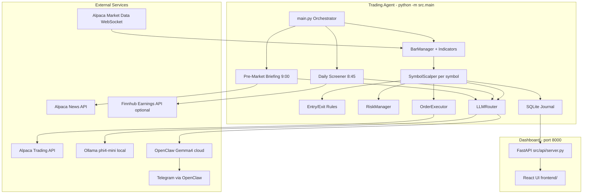

### Design principles

| Principle | Implementation |
|-----------|----------------|
| LLM never forces a trade | `trade_veto()` returns approve/reject only |
| Rules are fast | VWAP, RSI, volume evaluated on every bar |
| LLM is slow | 3s timeout; fallback to OpenClaw if Ollama fails |
| Risk is hard-coded | Kill switch, position limits — not delegated to AI |
| Bracket orders protect crashes | Stop-loss + take-profit on Alpaca even if server dies |

---

## 2. Daily Timeline (What Runs When)

All times are **US Eastern** (`America/New_York`).

```mermaid
gantt
    title Weekday Trading Day (ET)
    dateFormat HH:mm
    axisFormat %H:%M

    section Morning
    Screener runs           :08:45, 5m
    Pre-market briefing     :09:00, 5m
    Bar warmup + streams    :09:25, 5m

    section Trading Session
    Scalping active         :09:30, 120m
    Watchlist re-rank       :09:30, 120m

    section End
    Flatten positions       :11:30, 1m
    Daily P&L summary       :11:31, 2m
```

| Time | Event | What happens |
|------|-------|--------------|
| **08:45** | Daily screener | Fetches most-actives/movers → filters → enriches → LLM ranks 3 picks → watchlist = SPY + QQQ + 3 dynamic |
| **09:00** | Pre-market briefing | Fetches 24h news → keyword scan → LLM avoid/caution list → symbols blocked for entries |
| **09:30** | Session start | 1-min bar stream live; scalper evaluates each symbol on every bar |
| **Every 10 min** | Watchlist re-rank | LLM re-prioritizes symbols (logged, informational) |
| **11:30** | Session end | All positions flattened; daily P&L saved; OpenClaw daily summary alert |
| **Any time** | Kill switch | If daily loss ≥ 2% → flatten, stop agent, alert |

---

## 3. Full Pipeline Diagram

### Per-symbol trade decision flow (every 1-minute bar)

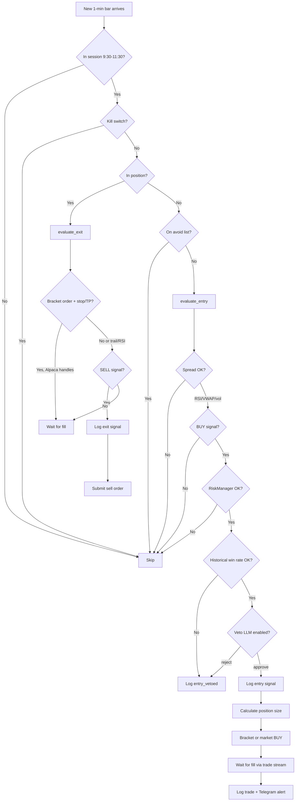

---

## 4. Configuration Reference (All Values)

### 4.1 Environment variables (`.env`)

| Variable | Default / Example | Purpose |
|----------|-------------------|---------|
| `ALPACA_API_KEY` | *(required)* | Alpaca paper API key |
| `ALPACA_SECRET_KEY` | *(required)* | Alpaca paper secret |
| `ALPACA_BASE_URL` | `https://paper-api.alpaca.markets` | Paper vs live endpoint |
| `ALPACA_DATA_FEED` | `iex` | `iex` (free) or `sip` (paid, faster) |
| `OLLAMA_HOST` | `http://127.0.0.1:11434` | Local Ollama server |
| `OLLAMA_MODEL` | `phi4-mini` | Primary LLM model |
| `OPENCLAW_GATEWAY_URL` | `http://127.0.0.1:18789` | OpenClaw gateway |
| `OPENCLAW_MODEL` | `gemma4:cloud` | Fallback cloud model |
| `OPENCLAW_ALERT_CHANNEL` | `telegram` | Alert destination |
| `ALERT_WEBHOOK_URL` | *(optional)* | Webhook if not using OpenClaw |
| `FINNHUB_API_KEY` | *(optional)* | Earnings calendar filter |
| `DASHBOARD_HOST` | `0.0.0.0` | Dashboard API bind address |
| `DASHBOARD_PORT` | `8000` | Dashboard port |

### 4.2 Strategy (`config/settings.yaml` → `strategy`)

| Setting | Value | Meaning |
|---------|-------|---------|
| `rsi_period` | **14** | RSI lookback bars |
| `rsi_oversold` | **35** | Buy when RSI ≤ this (bounce setup) |
| `rsi_overbought` | **65** | Sell when RSI ≥ this (if in profit) |
| `volume_spike_ratio` | **1.5** | Current bar volume must be ≥ 1.5× 20-bar average |
| `vwap_deviation_pct` | **0.15** | Price must be ≥ 0.15% below VWAP |
| `take_profit_pct` | **0.20** | Exit at +0.20% gain |
| `stop_loss_pct` | **0.12** | Exit at −0.12% loss |
| `trailing_stop_pct` | **0.10** | Exit if price drops 0.10% from session high (while profitable) |

**Entry condition (all must be true):**
- RSI ≤ 35
- Price ≤ VWAP − 0.15%
- Volume ratio ≥ 1.5
- Bid-ask spread < 0.03%

### 4.3 Session (`session`)

| Setting | Value |
|---------|-------|
| `timezone` | `America/New_York` |
| `start_time` | `09:30` |
| `end_time` | `11:30` |

### 4.4 Risk (`risk`)

| Setting | Value | Meaning |
|---------|-------|---------|
| `max_risk_per_trade_pct` | **1.0%** | Max equity risked per trade (drives position size) |
| `daily_max_loss_pct` | **2.0%** | Kill switch if equity drops 2% from session start |
| `max_open_positions` | **2** | Max simultaneous holdings |
| `pdt_equity_threshold` | **$25,000** | Below this, PDT rules apply |
| `max_day_trades` | **3** | Max round-trips per day if equity < $25k |

**Position size formula:**
```
risk_amount = equity × 1%
stop_distance = entry_price × 0.12%
shares = floor(risk_amount / stop_distance)
capped at 10% of equity / price
minimum 1 share
```

### 4.5 LLM (`llm`)

| Setting | Value | Meaning |
|---------|-------|---------|
| `enabled` | **true** | Master switch for veto + ranking |
| `confidence_threshold` | **0.7** | Below this → fallback to OpenClaw |
| `timeout_seconds` | **3** | Ollama call timeout |
| `watchlist_interval_minutes` | **10** | Intraday re-rank frequency |

### 4.6 Execution (`execution`)

| Setting | Value | Meaning |
|---------|-------|---------|
| `max_spread_pct` | **0.03** | Block entry if spread ≥ 0.03% |
| `use_bracket_orders` | **true** | Attach TP/SL to Alpaca on buy |

**Bracket prices (example @ $100 entry):**
- Take profit: $100.20 (+0.20%)
- Stop loss: $99.88 (−0.12%)

### 4.7 Briefing (`briefing`)

| Setting | Value |
|---------|-------|
| `enabled` | **true** |
| `time` | **09:00** |
| `news_lookback_hours` | **24** |
| `news_limit` | **10** articles |

**Keyword auto-flag:** earnings, fda, guidance, downgrade, lawsuit, sec, investigation

### 4.8 Journal context (`journal_context`)

| Setting | Value | Meaning |
|---------|-------|---------|
| `enabled` | **true** | Use past trade stats in veto |
| `rsi_tolerance` | **5** | Match similar setups ±5 RSI |
| `lookback_days` | **30** | History window |
| `min_trades_for_veto` | **5** | Need ≥5 similar past trades |
| `min_win_rate` | **0.4** | Block if win rate < 40% |

### 4.9 Screener (`screener`)

| Setting | Value | Meaning |
|---------|-------|---------|
| `enabled` | **true** | Dynamic watchlist |
| `mode` | **hybrid** | `hybrid` \| `dynamic` \| `static` |
| `anchor_symbols` | **SPY, QQQ** | Always on watchlist |
| `dynamic_slots` | **3** | LLM-picked symbols per day |
| `run_time` | **08:45** | When screener runs |
| `candidate_pool_size` | **30** | Top N from Alpaca screener |
| `min_price` | **$15** | Filter cheap stocks |
| `max_price` | **$500** | Filter very expensive |
| `min_volume` | **1,000,000** | Min daily volume |
| `max_percent_change` | **8.0%** | Skip extreme movers |
| `finnhub_enabled` | **true** | Earnings-day filter (needs API key) |
| `exclude_yesterday_losers` | **true** | Skip symbols that lost money yesterday |

**Today's watchlist (hybrid mode):** `SPY, QQQ` + 3 screener picks = **5 symbols**

### 4.10 Journal database (`journal`)

| Setting | Value |
|---------|-------|
| `db_path` | `data/trades.db` |

### 4.11 Static symbols (fallback when `screener.mode: static`)

`AAPL, MSFT, SPY, QQQ, NVDA`

---

## 5. Module-by-Module Breakdown

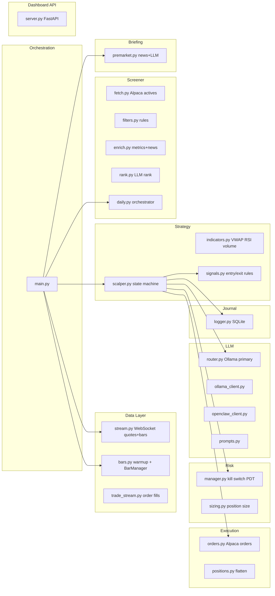

| Module | File | Responsibility |
|--------|------|----------------|
| **Orchestrator** | `src/main.py` | Startup, screener, briefing, streams, session guard, kill switch |
| **Quote/Bar stream** | `src/data/stream.py` | Alpaca WebSocket: live quotes + 1-min bars |
| **Bar warmup** | `src/data/bars.py` | Load 2 days of 1-min history so RSI/VWAP ready at open |
| **Order fills** | `src/data/trade_stream.py` | Alpaca trading WebSocket for fill events |
| **Indicators** | `src/strategy/indicators.py` | VWAP, RSI(14), 20-bar avg volume, spread from quote |
| **Signals** | `src/strategy/signals.py` | Pure rule evaluation — no AI |
| **Scalper** | `src/strategy/scalper.py` | Per-symbol state machine: IDLE → BUY → IN_POSITION → SELL |
| **Orders** | `src/execution/orders.py` | Market/limit/bracket orders via Alpaca |
| **Positions** | `src/execution/positions.py` | Flatten all at session end |
| **Risk** | `src/risk/manager.py` | Kill switch, max positions, PDT guard |
| **Sizing** | `src/risk/sizing.py` | Shares from 1% risk / 0.12% stop |
| **LLM router** | `src/llm/router.py` | Ollama first, OpenClaw fallback, fail-safe reject |
| **Screener** | `src/screener/*` | Daily stock picking pipeline |
| **Briefing** | `src/briefing/premarket.py` | News risk before open |
| **Journal** | `src/journal/logger.py` | All signals, trades, events, watchlist → SQLite |
| **Dashboard API** | `src/api/server.py` | REST API for React UI |
| **Frontend** | `frontend/` | React dashboard on port 8000 |

---

## 6. Entry Signal Logic (Buy)

```mermaid
flowchart TD
    A[1-min bar closes] --> B{RSI ≤ 35?}
    B -->|No| HOLD
    B -->|Yes| C{Price ≤ VWAP - 0.15%?}
    C -->|No| HOLD
    C -->|Yes| D{Volume ≥ 1.5× avg?}
    D -->|No| HOLD
    D -->|Yes| E{Spread < 0.03%?}
    E -->|No| HOLD spread_too_wide
    E -->|Yes| F[BUY signal: vwap_rsi_volume_bounce]
    F --> G[Journal history check]
    G --> H[LLM veto]
    H --> I[Submit order]
```

**Logged to `signals` table:** `signal_type=entry`, `details=vwap_rsi_volume_bounce`, plus RSI/VWAP/volume and LLM reason.

**If vetoed:** `signal_type=entry_vetoed` with LLM or journal reason.

---

## 7. Exit Signal Logic (Sell)

| Reason | Condition | Who executes |
|--------|-----------|--------------|
| `stop_loss` | P&L ≤ −0.12% | Alpaca bracket (if enabled) or bot |
| `take_profit` | P&L ≥ +0.20% | Alpaca bracket (if enabled) or bot |
| `trailing_stop` | Down 0.10% from high since entry, still profitable | Bot (market sell) |
| `rsi_overbought` | RSI ≥ 65 and P&L > 0 | Bot (market sell) |

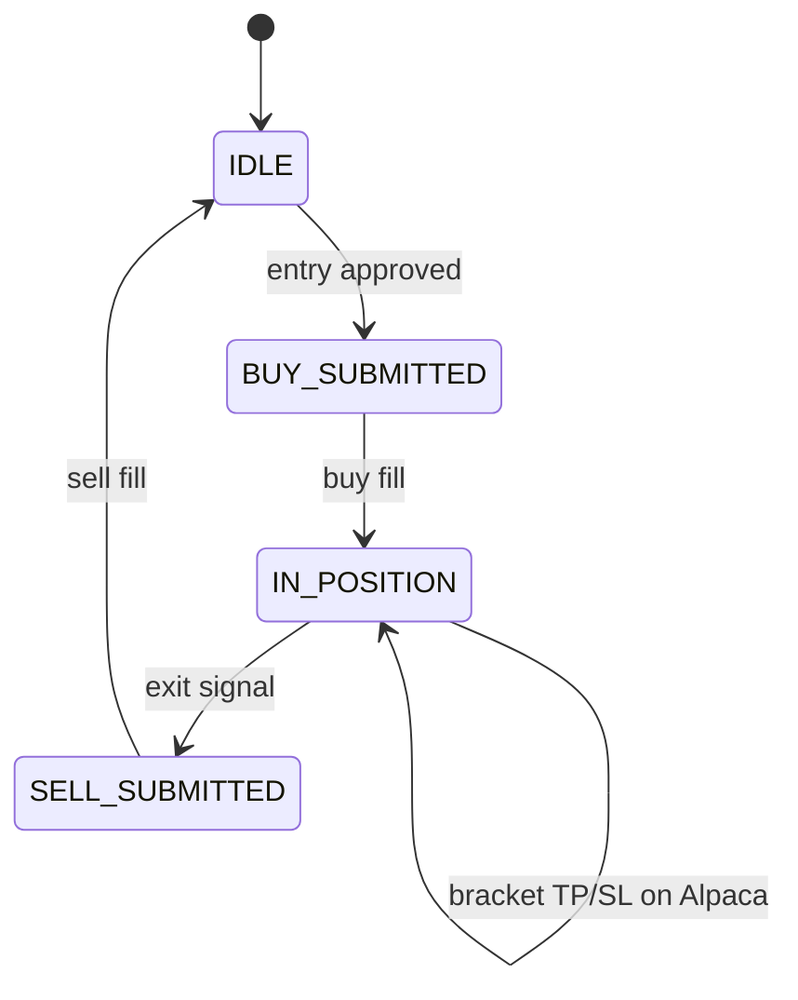

**Logged:** `signals` table (`exit` + reason), `trades` table (sell with P&L and exit reason).

---

## 8. LLM Layer (Ollama + OpenClaw)

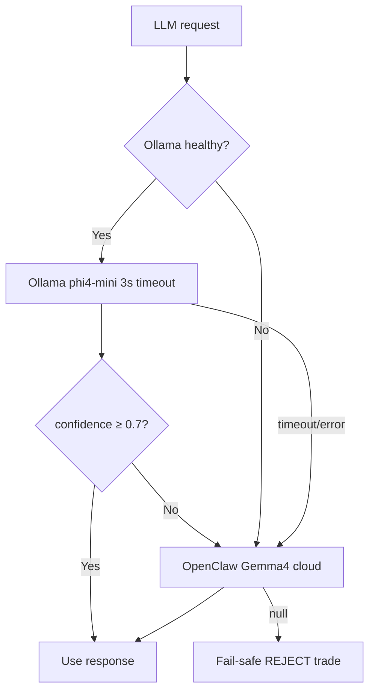

### LLM tasks (what AI does)

| Task | When | Model | Can trade? |
|------|------|-------|------------|
| **Trade veto** | Each buy signal | Ollama → OpenClaw | Approve/reject only |
| **Screener rank** | 8:45 AM | Ollama → OpenClaw | Pick 3 symbols |
| **Pre-market briefing** | 9:00 AM | Ollama → OpenClaw | Avoid/caution lists |
| **Watchlist rank** | Every 10 min | Ollama → OpenClaw | Informational only |
| **Daily summary** | 11:30 AM | OpenClaw | Alert text only |
| **Trade alerts** | On fill | OpenClaw → Telegram | Notification only |

### LLM cannot:
- Pick random stocks outside screener rules
- Force a buy without a rule signal
- Override kill switch or risk limits
- Change stop-loss / take-profit percentages

---

## 9. Risk Management

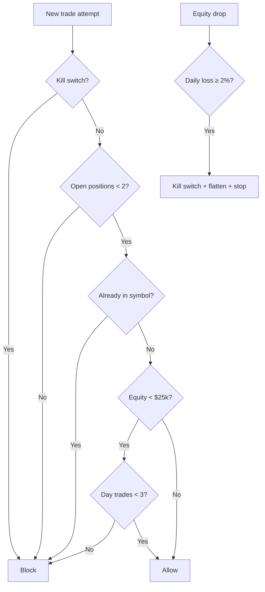

---

## 10. Daily Screener Pipeline

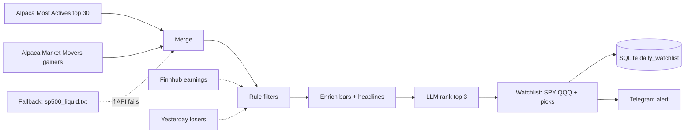

### Filters applied

1. Price $15 – $500  
2. Volume ≥ 1M  
3. |% change| ≤ 8%  
4. Not on earnings today (Finnhub)  
5. Not a yesterday loser (from journal)  
6. Anchors (SPY/QQQ) excluded from dynamic pool  

### Enrichment per candidate
- Gap %, volume ratio, ATR %, recent headlines (Alpaca News)

---

## 11. Pre-Market Briefing Pipeline

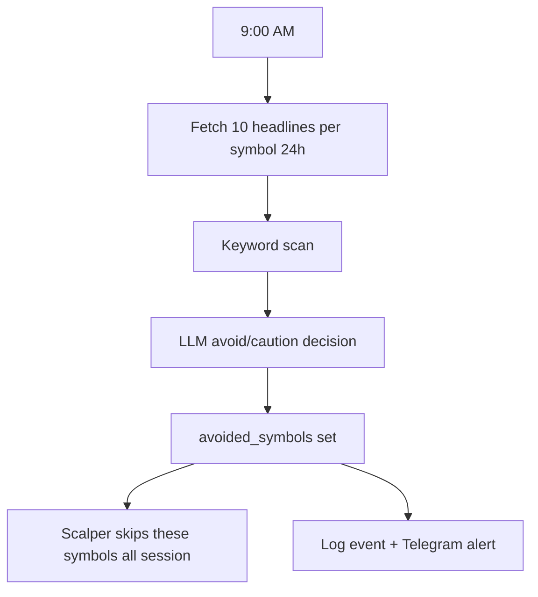

**Blocked symbols:** No new entries for rest of session (existing positions still managed).

---

## 12. Order Execution

| Order type | When used |
|------------|-----------|
| **Bracket market BUY** | Default entry — includes TP limit + SL stop on Alpaca |
| **Market BUY** | If `use_bracket_orders: false` |
| **Limit SELL** | Stop-loss / take-profit exits (non-bracket) |
| **Market SELL** | Trailing stop, RSI overbought |
| **Cancel open orders** | Before software-initiated sell |

---

## 13. Data Storage (SQLite)

**Database:** `data/trades.db`

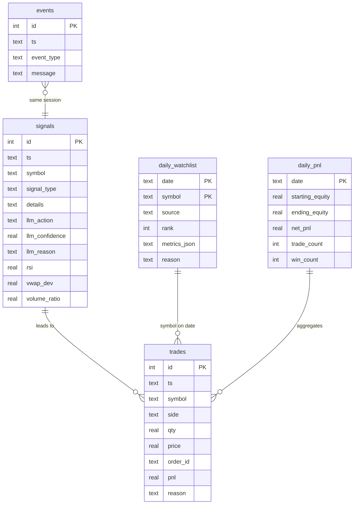

### What gets logged

| Event | Table | Example |
|-------|-------|---------|
| Buy signal approved | `signals` | entry + LLM reason |
| Buy vetoed | `signals` | entry_vetoed |
| Exit triggered | `signals` | exit, stop_loss |
| Order filled | `trades` | buy/sell + P&L |
| Pre-market briefing | `events` | premarket_briefing |
| Watchlist re-rank | `events` | watchlist_rank |
| Screener result | `daily_watchlist` | per symbol + reason |
| End of day | `daily_pnl` | equity + win count |

**Agent file log:** `logs/agent.log` (all Python logging)

---

## 14. Dashboard (React Frontend)

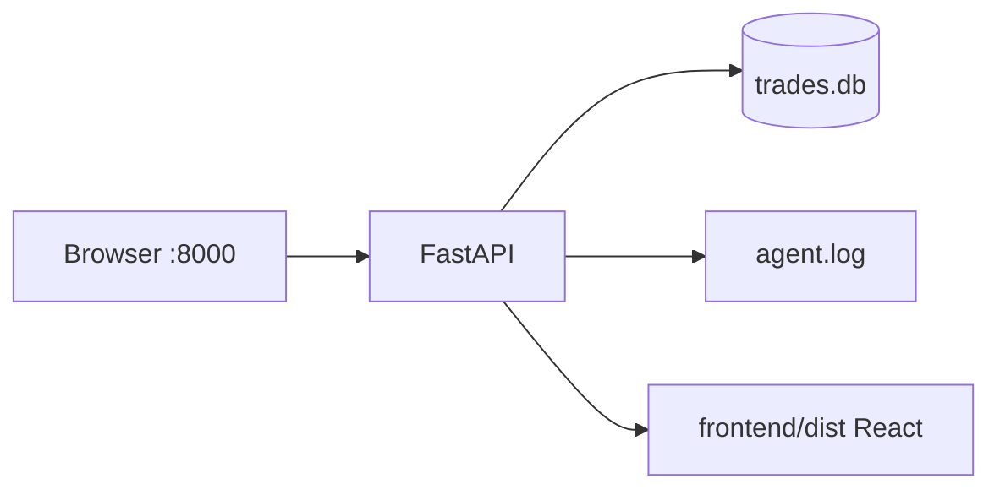

| Page | Data source | Shows |
|------|-------------|-------|
| Overview | summary + stats + watchlist | P&L, win rate, config |
| Trades & Reasons | round-trips | Why bought, why sold, AI reason |
| AI Decisions | signals | All entries, vetoes, exits |
| Screener | daily_watchlist | Daily picks + metrics |
| Events | events | Briefings, re-ranks |
| P&L History | daily_pnl | Chart + table |
| Agent Logs | agent.log | Live tail, 5s refresh |

**Run:** `python scripts/run_dashboard.py` → http://localhost:8000

---

## 15. Alerts & Notifications

All alerts go through **OpenClaw** → **Telegram** (configurable).

| Alert | Trigger |
|-------|---------|
| Agent Started | `python -m src.main` startup |
| Daily Screener | 8:45 watchlist + reasons |
| Pre-Market Briefing | Avoid/caution lists |
| Trade Fill | Buy or sell fill + P&L |
| Daily P&L Summary | 11:30 session end |
| Kill Switch | Daily max loss hit |

---

## 16. How to Run Everything

```bash
# 1. Setup (once)
cd AI_Stock_portfolio
python3 -m venv .venv && source .venv/bin/activate
pip install -r requirements.txt
cp .env.example .env   # add Alpaca keys

# 2. Start Ollama (Kali/Mac)
ollama serve
ollama pull phi4-mini

# 3. Start OpenClaw gateway (for fallback + alerts)

# 4. Trading agent (weekdays, waits for 8:45 if started early)
python -m src.main

# 5. Dashboard (anytime, read-only)
cd frontend && npm install && npm run build && cd ..
python scripts/run_dashboard.py
# → http://localhost:8000

# 6. Reports (CLI)
python scripts/paper_report.py
python scripts/screener_report.py
python scripts/backtest.py
```

### Systemd (Kali Linux)

| Service | File | Command |
|---------|------|---------|
| Trading agent | `systemd/trading-agent.service` | `python -m src.main` |
| Dashboard | `systemd/trading-dashboard.service` | `python scripts/run_dashboard.py` |

---

## 17. File Map

```
AI_Stock_portfolio/
├── config/settings.yaml          # All tunable parameters
├── .env                          # API keys (not committed)
├── data/
│   ├── trades.db                 # SQLite journal
│   └── universe/sp500_liquid.txt # Screener fallback universe
├── logs/agent.log                # Runtime log file
├── scripts/
│   ├── run_dashboard.py          # Start dashboard API
│   ├── paper_report.py           # CLI daily report
│   ├── screener_report.py        # CLI screener report
│   └── backtest.py               # Historical backtest
├── src/
│   ├── main.py                   # Agent entry point
│   ├── config.py                 # Config loader
│   ├── api/server.py             # Dashboard REST API
│   ├── data/                     # Streams + bars
│   ├── strategy/                 # Indicators, signals, scalper
│   ├── execution/                # Orders, positions
│   ├── risk/                     # Risk manager, sizing
│   ├── llm/                      # Ollama, OpenClaw, prompts
│   ├── screener/                 # Daily stock picker
│   ├── briefing/                 # Pre-market news
│   └── journal/                  # SQLite logger
├── frontend/                     # React dashboard
└── systemd/                      # Linux service units
```

---

## Quick Reference Card

| Question | Answer |
|----------|--------|
| What stocks does it trade? | SPY + QQQ + 3 daily screener picks (hybrid mode) |
| When does it trade? | 9:30–11:30 AM ET, weekdays |
| What triggers a buy? | RSI≤35 + below VWAP + volume spike + tight spread |
| What triggers a sell? | −0.12% stop, +0.20% target, 0.10% trail, RSI≥65 |
| What does AI do? | Veto bad entries, rank screener, briefing, alerts |
| What does AI NOT do? | Pick trades alone, override risk, go live without rules |
| Where is history? | `data/trades.db` + dashboard at :8000 |
| Paper or live? | Paper by default (`ALPACA_BASE_URL`) |

---

*Generated from codebase state. Edit `config/settings.yaml` and `.env` to change behavior.*
